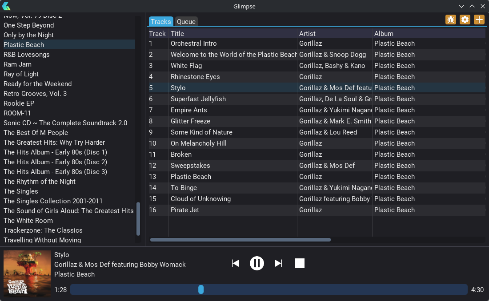

# [Glimpse](https://glimpseplayer.com/)
The free & extensible cross-platform music player.

## Features

### Audio Playback
Glimpse supports 4 major audio formats:
- MP3
- FLAC
- WAV
- Ogg Vorbis

With plans to support more.

### Cross-platform
Glimpse runs on all 3 major desktop OSes:
- Windows 10+ (Version 1809 minimum)
- Linux (tested with both Fedora and Arch Linux)
- macOS 14+ (may work with earlier versions, untested)
  - macOS support is still new and experimental and may have issues
  - Does not yet have integration with the system media controls

### Extensible
Glimpse can be easily extended with plugins written in C# using the official API.

### Free and Offline
Glimpse is, and will always be, completely free to use, with no premium features. 

Glimpse also does not connect to the internet, apart from a single update check on startup, which can be switched off.

If you like Glimpse and you'd like help to support development, please consider [Donating](https://ko-fi.com/aquagoose).